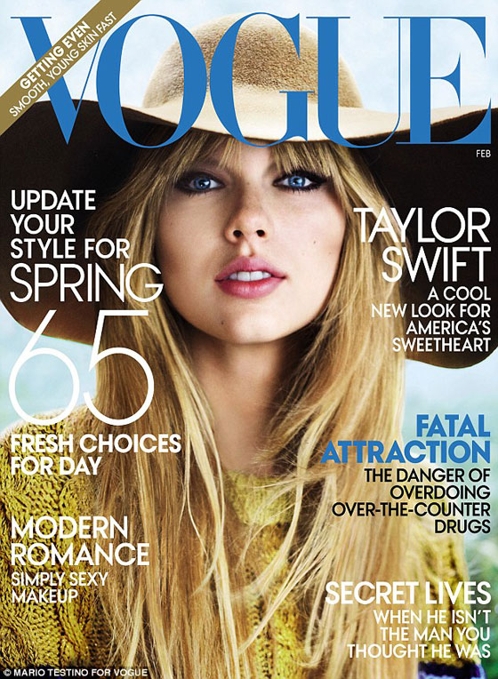

# Reto II: Poster Magazine Website - SASS

## ¿Qué vas a crear?

En este reto, vas a crear un sitio web contenga una portada promocional de resvistas. utilizando HTML y SASS.

Ten encuenta, antes de desarrollar, tener preparado los recursos como:

- Imágenes con fondo transparente
- Fuentes de estilo
- Paleta de colores

## ¿Qué vas a aprender?

- **Fundamentos de SASS:** Variables, anidamiento, mixins, funciones, herencia y operadores.
- **Organización de código:** Cómo estructurar tus archivos SASS para una mejor mantenibilidad.
- **Buenas prácticas de CSS:** Escribir código CSS limpio, eficiente y reutilizable.
- **Metodologías de CSS:** Entenderás cómo organizar tu código CSS utilizando metodologías como BEM (Block Element Modifier).
- **Preprocesadores:** Aprenderás a compilar archivos SASS a CSS y cómo integrarlos en tu flujo de trabajo.

## ¿Qué se va a evaluar?

- [ ] **Organización de recursos:**
  - Fuentes de texto
  - Paleta de colores
  - Reset CSS
- [ ] **Uso de herramientas como:**
  - Mixins
  - Functions
  - Variables
  - Extends
- [ ] **Código limpio y modular:**
  - Utilizar metodología BEM
  - Reorganizar cada widget o componente por un archivo sass.
- [ ] **Uso de propiedades css:**
  - box-model:
    - margin
    - padding
  - position
  - z-index
  - display: grid
  - display: flexbox

## Recursos

- [PNG Eggs | Imágenes PNG](https://www.pngegg.com/es)
- [What ¿he Font](https://www.myfonts.com/pages/whatthefont)
- [SASS - Por qué usar SASS ? - Estructura de carpetas](https://dev.to/fernandomoyano/sass-464d)
- [CSS Gracdiend](https://cssgradient.io/)

### HTML & CSS

- 🎥 [HolaMundo | Aprende HTML ahora! curso completo GRATIS desde cero](https://www.youtube.com/watch?v=MJkdaVFHrto)
- 🎥 [HolaMundo | Aprende CSS ahora! curso completo GRATIS desde cero](https://www.youtube.com/watch?v=wZniZEbPAzk)
- 🎥 [Soy Dalto | Curso de HTML y CSS desde CERO (Completo) cero](https://www.youtube.com/watch?v=ELSm-G201Ls)

### SASS:

- [SASS Documentation](https://sass-lang.com/)
- [sass npm](https://www.npmjs.com/package/sass)
- [Blocks, Elements and Modifiers](https://getbem.com/introduction/)
- [Creando proyectos CSS mantenibles con SASS y BEM](https://medium.com/laboratoria-how-to/creando-proyectos-css-mantenibles-con-sass-y-bem-54e013c7b1d9)
